# Tutorial 1 - Setup
Remember the scenes in Hollywood movies where hackers sit in front of a computer and type something definitely not in English in a black window like this?  

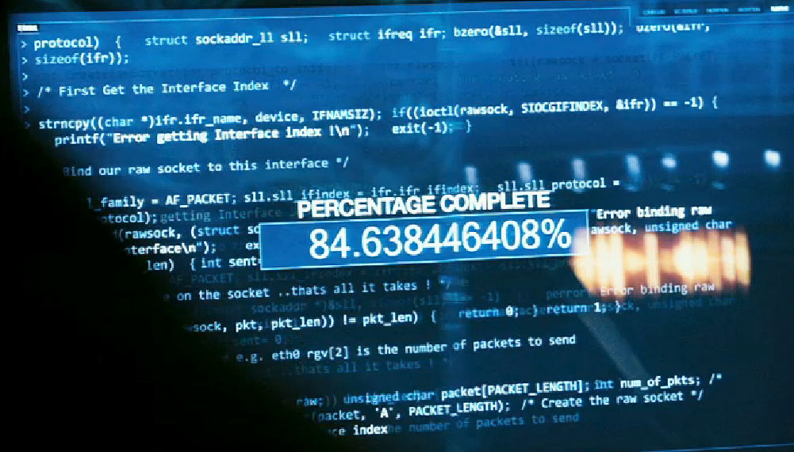  

In this tutorial, we're going to learn to set up the terminal, which is a black screen you can type stuff in (but you can set it to any other color you want). You'll see that it won't be anything like in those hacker movies, (and if you read more online you'll see that those hacking scences ain't anything like the real world hacks...) but it will still be very cool I promise.  

Before we get into the terminal part, we'll first go through some setup and get you download a few tools to your computer. This tutorial and the rest will be done with the assumption that you're using a Mac. ***If you've not updated your mac to the latest OS, please do so. Remember to backup your data, always backup your data first!***

- [Tutorial 1 - Setup](#tutorial-1---setup)
  - [Spotlight](#spotlight)
  - [iTerm2](#iterm2)
  - [VSCode](#vscode)
  - [Command-line tools](#command-line-tools)
  - [Homebrew](#homebrew)
  - [Oh-my-zsh](#oh-my-zsh)
  - [Something cool](#something-cool)
    - [youtube-dl](#youtube-dl)
    - [Watching Star Wars](#watching-star-wars)
    - [Matrix](#matrix)
  - [References](#references)

## Spotlight
Your Mac comes not with fries but a powerful tool called Spotlight. It's that magnifier icon on the upper right:

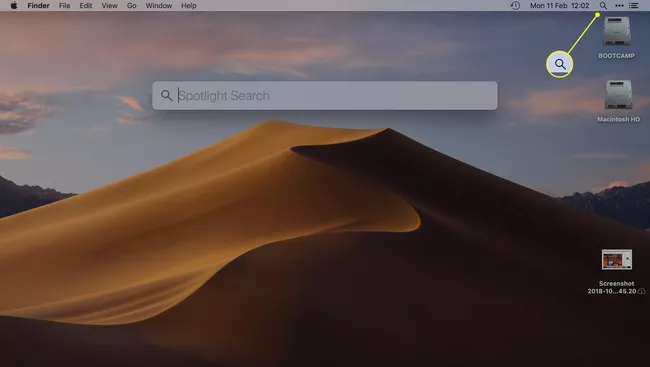

Spotlight can **index** your whole computer. You'll come across the term *index* more often when you learn about search. Think of it as a way to mark every stuff in your computer so it's easier to find later.  

Gone are the days you have to click on Launchpad and look around for an app. Now you just have to launch Spotlight/Alfred and type in the name of the app it'll find it for you. The only thing you have to do is to set a shortcut for launching Alfred/Spotlight.

To find out/set the shortcut for launching spotlight, you go to System Preferences --> Keyboard --> Shortcuts --> Choose Spotlight on the left column.

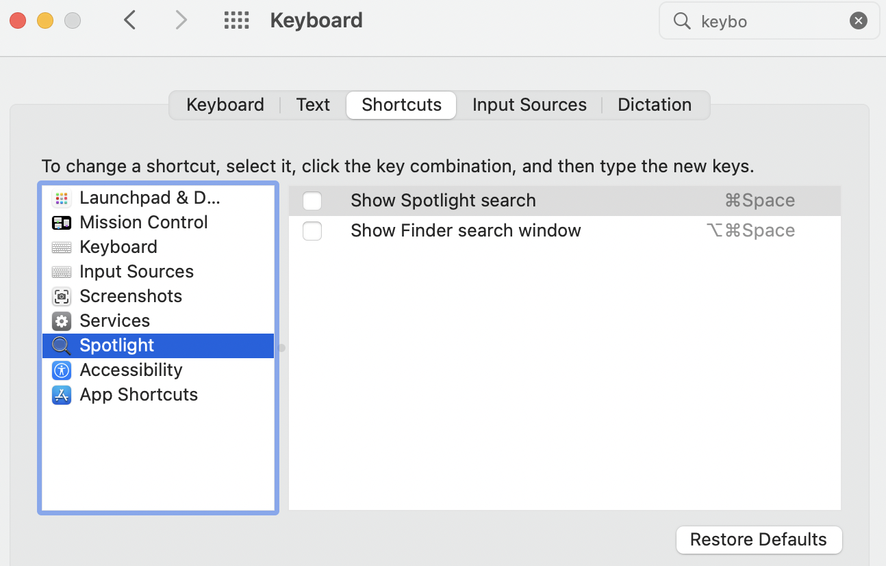

You only need to check `Show Spotlight search`, then click on the box on the right, enter your shortcut and Enter. I often use `command + space` (command symbol = ugly 4-leaf clover), so just like in the screenshot above.  

Now just `command + space`, Spotlight should show up for you. Then type on the name of whatever you want to find, it shall shown you a bunch of results to choose from. For example here I'm looking for VS Code:

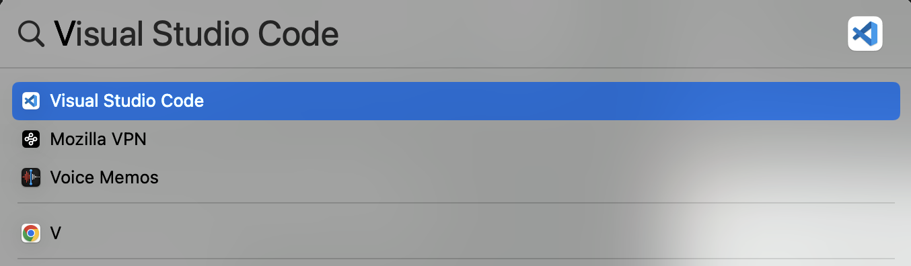

## iTerm2
Mac comes with a terminal app, but it's not good enough. Please use iTerm2, download from [here](https://iterm2.com/downloads.html).  

It should download a .zip file, just click on it to extract the app. Drag & drop it to the `Applications` folder then you're good to go.  

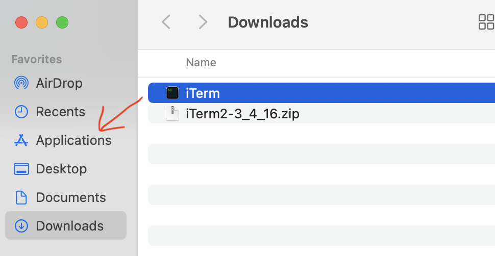

## VSCode
VSCode (Visual Studio Code) is a code editor, i.e. a text-editor but for code. Think of it like Microsoft Word but has all sort of fancy functions to support writing code.  

Similar to iTerm2, just download it, click on the zip file to extract, then drag & drop to `Applications` folder.  

## Command-line tools
On the way to learn programming, you'll have to use a lot of supporting tools. Don't have to think too much about it, just know that you'll need a lot of tools. Don't need to know what they are, just know you can install most of them through `Xcode Command-line Tools`. To do this, open your iTerm2:
- `command + space` to launch Spotlight
- type in `iTerm2`
- Use up/down arrows to select `iTerm2` and enter

In the iTerm2 window, type in `xcode-select --install`, and Enter. You'll see something like this:

Just click Install & wait until it looks like this:

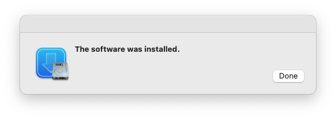

## Homebrew
In the next tutorial when we learn more about the terminal, we'll see that there are a lot of cool programs we can run there. But just like life, computers and programs are ever changing. To control this, we often designate a version to a release of a software so we know which is which. This is very important. For example, you're writing a program that depends on another program X. You test and know for sure your code works fine if X_version=1.0. But you'll never know if X_version=1.1 will stay the same or not, so you should specifically mention in your code that it has to be X_version=1.0.  

Anyway, this highlights a need to have some software to manager all versions of any program. Software like this is called package manager. A program is a package. A library (just think of it as a bunch of supporting code) is also a package. And a package manager knows all of them, past and future, one ring to rule them all.  

For mac, the most popular package manager is called Homebrew. To install it, simply head to [brew.sh](https://brew.sh/), copy & paste the command there into your iTerm2 window and Enter.  

You can find example screenshots of the installation [on this website](https://phoenixnap.com/kb/install-homebrew-on-mac#ftoc-heading-3).  

We'll see how to use homebrew to install something later.

## Oh-my-zsh
If you open your iTerm2 window right you, you can see that it's kinda...boring. There's a tool to make it more colorful, but more importantly, make it much easier to use through crazy tons of built-in functions. It's called oh-my-zsh. We'll talk about zsh later.  

To install oh-my-zsh, simply run a command copied from [https://ohmyz.sh/#install](https://ohmyz.sh/#install).  

If it asks, just say Yes. We'll see how much easier oh-my-zsh does to your life later.  

## Something cool
Now you have a Terminal!!! Now, I promised something cool, so let's try something cool!

### youtube-dl
Do you know you can download youtube videos from your computer, without using any website or sketchy software??? Lemme welcome you to [youtube-dl](https://github.com/ytdl-org/youtube-dl)!  

Let's install it with Homebrew, in an iTerm2 window, type in:  

 `brew install youtube-dl`  

 It should look like this:
 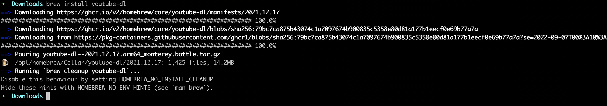

Let's download this song to practice the living room routine. In your iTerm2 window, enter:  

`youtube-dl https://www.youtube.com/watch\?v\=zzRr55RGYc4`

It'll proceed to download and looks like this:  

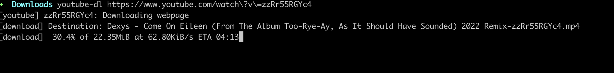  

Btw, if you're looking for the best video player for mac, try [IINA](https://iina.io/).  

### Watching Star Wars
Yeah, I'm not kidding. You can watch Star Wars from the Terminal!  

First install `telnet`:  

`brew install telnet`  

After telnet is successfully installed, type in:  

`telnet towel.blinkenlights.nl`  

and Enter! Enjoy. Recommend with some popcorns.  

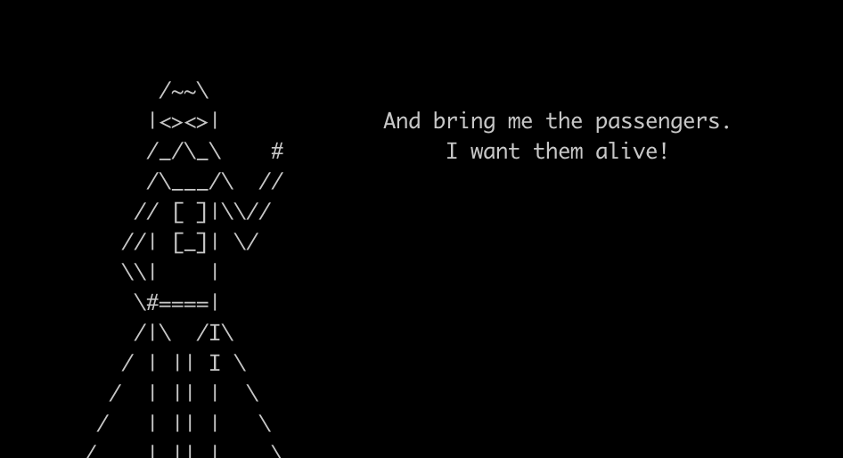
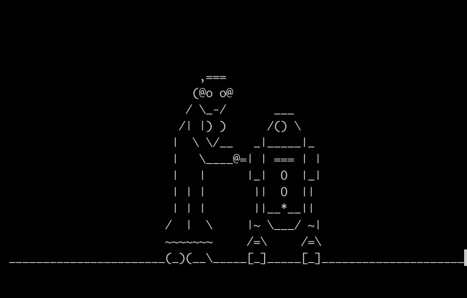

### Matrix
You'll learn how to print something on the terminal later. Now think about it, that scence in the Matrix is simply printing out letters/digits on the terminal continuously, right? Somebody already wrote it so we can simply test it out. The source is from [here](https://osxdaily.com/2013/08/15/turn-the-terminal-into-a-matrix-style-scrolling-screen-of-binary-or-gibberish/). In your iTerm2 window, copy and paste this then Enter:  

`LC_ALL=C tr -c "[:digit:]" " " < /dev/urandom | dd cbs=$COLUMNS conv=unblock | GREP_COLOR="1;32" grep --color "[^ ]"`  

It shall look like this:  

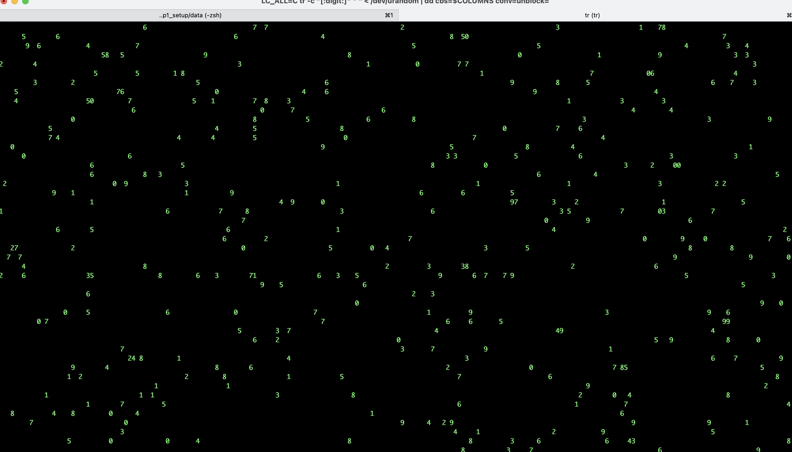  

## References
Images are copied from the following sources:
- https://blog-en.webroot.com/wp-content/uploads/2015/01/2vnrkw8.png
- https://www.lifewire.com/thmb/RkZFhWRUpyb3OXD7COey8c_L_Wo=/650x0/filters:no_upscale():max_bytes(150000):strip_icc():format(webp)/001-use-spotlight-mac-4586951-4db79788ac374ef388688ceb701264c4.jpg
- https://mac.install.guide/assets/images/ruby/install-Xcode-CLT.png
- https://mac.install.guide/assets/images/ruby/install-Xcode-CLT-done.png  