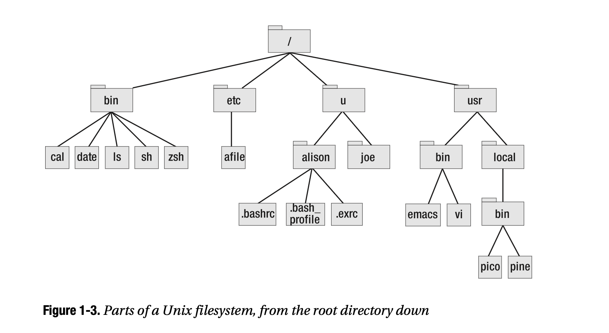

# Tutorial 2 - iTerm2 & zsh/bash
In previous tutorial, we've setup several tools that (I deem) are useful. In this one, we shall take a closer look at one of those tools, iTerm2! We also learn a bit more about the file system, how to interact with files/folders from terminal. We will also learn some useful programs that you can run from the terminal.  

Shell/terminal are powerful tools. This tutorial only aims to give you some familiarity with it. I don't know enough, I will never do. You will find yourself in similar position. You will learn enough to get your job done, but you will never stop learning something new about these wonderful tools. If you wonder why we have to use this instead of using other tools. Well, I won't provide examples in this tutorial since I think it's too much, but it's like this. A lot of programs/commands you'll be using in the terminal for your job, all of them provide tons of options to deal with different situations. For example, the `grep` command you'll learn later can help you check if a word appears in a file. But it can also help you check if `is there a date in the format dd-mm-yyyy in the file, no matter what date it is?` Think about it, if you want to check something like that, what application will you use? Are you going to open the file with Word and scan through it? `grep` can do that in less than a second (depending on how big the file is).

- [Tutorial 2 - iTerm2 & zsh/bash](#tutorial-2---iterm2--zshbash)
  - [iTerm2](#iterm2)
  - [Shell](#shell)
    - [File systems](#file-systems)
      - [**Navigation**](#navigation)
      - [**Interaction with files/directories**](#interaction-with-filesdirectories)
    - [Some useful programs/tips](#some-useful-programstips)
      - [mv](#mv)
      - [grep](#grep)
      - [Pipe](#pipe)
      - [wget](#wget)
      - [**open**](#open)
  - [Conclusion](#conclusion)
  - [References](#references)

## iTerm2
When you embark on this journey, you'll see the words `console, terminal, terminal emulator, shell` a lot. Along with the come other words like `gnome, guake, xterm...`. I'll try to shed some light into `shell` and `terminal`, but I'm not sure my understanding of history is correct. But you'll get why I say that soon.  

Back in the early days, computers weren't like what we're using right now. Early computers were electromechanical, andp eople used to literally write computer programs on pieces of paper called [punch card](https://en.wikipedia.org/wiki/Punched_card) which were read by the computer to get the instructions of what it should do. Since it was still mechanical, a moth was trapped causing the machine to stop working hence the term [bug](https://en.wikipedia.org/wiki/Software_bug#:~:text=Operators%20traced%20an%20error%20in,in%20a%20program%20a%20bug.).  

Anyway, pretty soon the machines got better and went full electric. But there was no graphical user interface, that is whatever you're seeing on your computer right now. There was no mouse cursor, no buttons, no drag-and-drop windows...To control a computer, you just had this piece of hardware called terminal which showed you a black screen which you could type input in. This terminal interacted with the computer through a program called `shell`. Think of a shell as a computer program that can talk directly to the operating system (OS). It can run a tons of programs such as aksing the operating system to create a file, delete a file, write this transcript of Friends episodes to a file, delete a bad joke that's not appropriate for 2022 anymore from a transcript,... so on and so on. And since the shell talks to the OS, it needs a language to communicate. That language is what you often hear as `bash` or `zsh` (pronounced z-shell). And soon after you use either bash or zsh along with Python for a while, you'll realize, it's just a language. Some are more difficult to learn than others, but sometimes the difficult ones are more efficient in some cases. And most importantly, you only need to know enough to get your job done.  

Now, my brief explanation of history above was half true and probably wrong in many places. My point is soon you'll see that you don't really care about the difference between `console, terminal, shell, emulator, gnome, guake, ...` at all. You just need to know `terminal` is something like iTerm2, and if you're using a Mac, highly likely that's the only terminal you'll need to use (along with the default one that comes with macOS but I doubt you'll use it, iTerm2 is just a lot better). And by `shell`, it only means `bash` or `zsh` (gee, I hope you don't have to deal with more than those 2).  

If you follow my setup and install iTerm2 + oh-my-zsh, your iTerm2 probably looks like this (ignore the `(base)` at the beginning of each line, it's just Anaconda for python, we'll talk about it later):

Here you can type in the commands you want the computer to run (hence the name `command-line interace`).  

For example, if you want to know the current date, type in `date` then Enter:  

  

Or you want to see the current month's calendar, type in `cal` and Enter:

  

Or you want to see what day Harry Potter was born, type in `cal 7 1980` and Enter (it was a Thursday):  

  

Or you want the OS to tell you what programs are running and how much CPU power it's using and so on and so on, type in `top` and Enter (to quit, press `q`):

iTerm2 comes with a lot of cool features, but I find the most important one is split the window (they call it `pane`).  

Split vertically, press `command + D`:

Split horizontally, press `command + shift + D`:

To delete any `pane`, press `control + D`.  

You can further tweak it by going to `iTerm2 --> Preferences`:

For example, here I often want to look at all the input/output I've been seeing so I set `Scrollback buffer` to `Unlimited Scrollback`.
  

Now, sometimes your terminal is full of commands and outputs and you just kinda want to reset it to empty (fresh start always sounds so good, doesn't it), just press `command + K`, it shall clear the terminal.  

iTerm2 has so much more to offer, but I'll leave it to you to explore.  

## Shell
Like I said, a shell is a program that can run a tons of other programs to interact with the OS. The most popular shell is called `bash`. You'll see it everywhere. However, with the latest macOS (I'm running Monterey 12.5.1), the default shell is now `zsh`. Just think about it this way, they are kinda the same... `zsh` is a superset of `bash`, i.e. it can do whatever `bash` can and more. For that reason, we'll assume we're using `zsh` here.  

And I'm gonna be honest, I am a far cry of a shell expert. Therefore, I'm just going to explain some of what I know and I think are going to be useful.  

### File systems
#### **Navigation**
Just think about it this way, everything in your computer is a file. A folder is called a directory, it's also a file, just more special. And everything is structured like a tree. It starts with something called `root` which is designated by `/`. Here's a screenshot I took from the book `From bash to zsh`:

And the path from root to a file/directory is called `pathname`. It's simply the name of each files/directories we have to go through separated by `/`. For example in the above, the pathname of `cal` is `/bin/cal`.

Using the terminal, you can navigate in the file systems using the following commands (type the command then press Enter):
- to know where you are: `pwd`
- to see what files/folders are in the current directory: `ls`
- to go up 1 level (to what's called `parent directory`): `cd ..` (or just `..`)
- `.` = current directory you're in, `..` = parent directory. So if you type in `cd .`, you'll stay where you are, but `cd ..` will bring you up 1 level
- to go into a directory: `cd pathname_of_that_directory`
- say you're inside directory `abc` which contains another directory `xyz`, you only need to `cd xyz`. This is called `relative path`. The pathname that starts all the way from `/` such as `/bin/cal` is called `fullpath`.
  
In macOS (or Linux), every user has a `home folder` at the path `/Users/username`. For example my username is `dora` then the path is `Users/dora`. This home folder is shortcut as `~` so whenever you type in `~` and enter, you go back to that folder.  

Let's say I have 2 folders `onepiece` and `dragonball` in my `Downloads` folder. Starting from `~`, I'll navigate between the folders like this:

**Exercise**: try to navigate/list your computer's file systems. To make it easy, try throwing some files into the Downloads folder and navigate as I do above.  

To better see the file system as a tree, you can install this program `brew install tree`. To a directory as a tree, you simply type `tree path_to_directory` and enter. For example, my folder for this set of tutorials currently looks like this:  

Do you see how I could use `.` in place of the fullpath of current directory in the `tree` command above?  

#### **Interaction with files/directories**
To create a file in current directory: `touch filename`

Do you see that originally there was no file called `phoebe.txt` but after the `touch` command, there is?

To see the file content: `cat path_to_file`

Since we only created the file, we didn't write anything into it, so it's empty.  

To overwrite the content of the file `echo something > path_to_file`. To append some content to the file `echo something >> path_to_file`. The key here is `>` will overwrite but `>>` only appends.  

In above example, you can see that when we use `>>` it will append the content of echo into a new line. But at the end when we use `>`, it overwrite the whole file with that content. Needless to say, you should be careful of `>` or `>>`.  

Since `cat` simply outputs the whole content of file into terminal, you don't want to do that with big files. Instead you can peek into the file by `less path_to_file`. You can navigate by the arrow buttons (up and down) and quit by pressing `q`.  

A really simple tool to quickly edit a file is `nano`. To open a file (or create a new one), just `nano path_to_file`. You can navigate using the arrow buttons. Type in anything you like, remove previous characters with `Delete` button, yeah just like you're typing on any program lol.

`nano` has a list of shortcut for commands like this. `^` means `control` button (can you see it on your keyboard?). To exit editing, type `control X`. If you've modified the file, `nano` will ask if you want to save the content.

Press `Y` + Enter will save the new content. A more complete tutorial to `nano` can be found [on this website](https://www.howtogeek.com/howto/42980/the-beginners-guide-to-nano-the-linux-command-line-text-editor/).  

For really quick editing, you can use nano. But more oftenly, people use vim/emacs, 2 powerful text editors you can use straight from the terminal. I personally use vim but I'm very much a newbie so I don't think I'm good enough to explain it to you. You can find a tutorial [here](https://www.tutorialspoint.com/vim/index.htm) or just google it.  

To delete a file, `rm path_to_file`.

For example here, I originally have file `friends.txt`, but after `rm friends.txt`, it's no longer there.  

To delete a folder, you have to `rm -rf path_to_folder`.

You can see `dragonball` is no longer there.  

**IMPORTANT!** Note that unlike `Move to trash` option that you often use with `Finder`, `rm` will completely remove the file/folder. So be careful when you use it!  

To move a file/folder: `mv path_to_file_folder path_to_new_parent_folder`.  
To create a new directory: `mkdir directory_name`

For example, I just created a new directory called `joy_boy` inside `onepiece` then moved `luffy.txt` into it. Similar to other commands, the path here could be relative or fullpaths.

At this point, you might ask, why would I need to use terminal when I can simply use Finder to navigate/move/delete files? Or to edit, why use vim/emacs/nano when I can simply open with some app like TextEdit, VSCode? To answer this, I'll say speed & convenience. Sometimes, you're working on the terminal, opening that file, waiting for the app to load, then find where to edit, then save the file.... it will just take too long and cut your workflow. Sometimes, the edit is just too small and quick to be worth using another app. Also, in terms of text editing, vim/emacs are really powerful and many people just like to use them instead, but I won't dive into this topic.  

### Some useful programs/tips
#### mv
In above, we talk about using `mv` to move a file/directory to another directory. `mv` could also be used to rename a file/directory.  

For example, I've just renamed `nami.txt` to `old_nami.txt` and `joy_boy` to `sad_boy`.

#### grep
`grep something path_to_file` will see if `something` is in that file.  

For example, in `phoebe.txt`, there's no `phoebe` so it returns empty. But when we grep `phone`, there is `phone` so it return that line containing `phone` with the word highlighted.  

In the introduction, I talked about grepping `mm-dd-yyyy` in a file, here's an example:

#### Pipe
In Unix/Linux, there's a powerful concept called `pipe`. It basically redirects the output from one command to another. For example, I can print out to terminal the content of `phoebe.txt` by using `cat`, but then redirect it as input to `grep`:  

As you can see, we do this by `command_1 something_1 | command_2 something_2 | ...` You can do this for as many commands as you want. This is a very powerful tool which you'll use more often. More a better tutorial, see [this one](https://www.geeksforgeeks.org/piping-in-unix-or-linux/#:~:text=A%20pipe%20is%20a%20form,program%2Fprocess%20for%20further%20processing.).

#### wget
`wget` is a program that can download files from the internet for you. If you type in `wget` and get `command not found`, it means `wget` is not installed in your system, just `brew install wget`. Why use wget when you can use, say, a browser to download file? Very often, you shall find yourself working on some computer server which the only access you have is the terminal. You won't have access to a terminal, then you'll have to use `wget`. 

Here, I'm downloading a photo from wikipedia article for One Piece to my computer, then use the command `open` to open it:

#### **open**
In Mac, you can open any file/folder from the terminal using the program `open`.  

- open current directory in folder: `open .`
- open parent directory in folder: `open ..`
- open any directory: `open path_to_directory`
- open a file: `open path_to_file` (this will use the default application for that file type)

Soon you'll find this program super useful. Give it a try and open some pdf or text file or even an image/video!  

## Conclusion
I hope the terminal is less strange to you now. From now open, to practice, try to use terminal to navigate the file system, create/delete files. To end this tutorial, you can find some (cute commands to run suggested in this link)[https://betterprogramming.pub/7-terminal-commands-that-will-just-make-you-smile-3f5bc8778080]

For example, I like train so I install `brew install sl`:

## References
- some screenshots were taken from this book [from bash to zsh](https://www.amazon.com/Bash-Shell-Conquering-Command-Line/dp/1590593766#:~:text=From%20Bash%20to%20Z%20Shell%3A%20Conquering%20the%20Command%20Line%20is,powerful%2C%20versatile%20shells%20ever%20written.)
