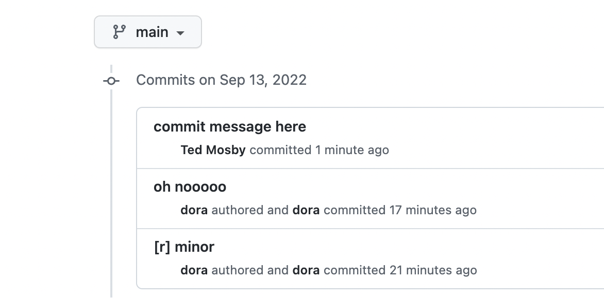

# Tutorial 3: VSCode, Git, and Github
Today we will go through the basics of VSCode, git, github, and you'll push some code to your github 😊.  

- [Tutorial 3: VSCode, Git, and Github](#tutorial-3-vscode-git-and-github)
  - [VSCode](#vscode)
  - [Git & Github](#git--github)
    - [Setup SSH for github](#setup-ssh-for-github)
    - [Testing](#testing)
    - [More git stuff](#more-git-stuff)
      - [**Clone**](#clone)
      - [**Branches**](#branches)
  - [Conclusion](#conclusion)


What is git? [Git is a free and open source distributed version control system designed to handle everything from small to very large projects with speed and efficiency.](https://git-scm.com/). I'm just kidding.  

Let's say you're working on this project X. You are trying to implement a new feature A for it. You finish and update the codebase with A. You're happy, going to get some coffee, smile ahihi to your friends. Then 1 hour later, you're called to be alerted that everything is down and highly likely it's the changes you make with A. Now how to go back? Save a copy before A and use it now? hmmm... sure...how would you go about and keep thousands of such archive? Or later on, how would you be able to identify which copy belongs to which timeframe?...  

Git saves you this trouble. Think of developing your codebases as building multiple versions of it. The latter is more beautiful and useful (or very often, not, in both accounts) than the formers. Git helps you to ID each version, save them all, go back to any of them if needed. Ofc, git is much more than that but that's all I know. Feel free to google to learn more about git.  

So what's github? Essentially an online storage that uses git. It offers more services too, but let's just keep it at that.  

That's git & github, so what is Visual Studio Code (VSCode)? To put it simply, it's a powerful code editor.  

Code is just text, therefore you can actually write code with any text editors out there, even with the TextEdit app that came with macOS. But through out your coding journey, you'll find yourself doing many things that are more specific to programming than to other forms of text editing. For example, take a look at how VSCode can have multiple cursors at different lines and edit them all at once:  

  

This is straight out of their [tips and tricks](https://code.visualstudio.com/docs/getstarted/tips-and-tricks) btw.  

Additionally, a good text editor can do more for you such as telling if you open a bracket `{` but forgot to close it `}`, or you're using a variable but you've never defined it, ... Most relevantly, it also supports git out of the box so you can visualize the changes you've made to a file & all of your git history too!  

To sum up, do use VSCode because:  
- it's very intuitive
- it has tons of extensions
- it's super fast
- its git support is absolutely amazing
- it supports editing on remote host natively  

What I mean by the last point is you can use VSCode to edit code from a remote computer such as a server.

## VSCode
We already talked about how to install VSCode in the [setup tutorial](https://github.com/ofcisly/too_simplified_tutorials/tree/main/chap1_setup#vscode).  

Now that you know how to use terminal, let's make use of that skill by launching VSCode from terminal! First, you need to install its command line though. Open VSCode, press `command + shift + P`, select `Shell Command: Install 'code' command in PATH` and Enter. It should now install the `code` command in your system.  

Let's create a brand new code repository for this tutorial.  


Here we create a new directory called `test_vscode`, we enter it and launch VSCode at that directory by running `code .`. (Do you remember that `.`?)  You should see VSCode opens that directory, like this:  

  

Since we're seeing nothing, why not create a file in that directory and see it appears in VSCode!  


  

Go a head and make some edit. As usual:  

- `command + S` = save
- `command + Q` = close current tab
- if you higlight a block of characters (or just a word) then keep pressing `command + D`, it'll select all occurences of such block of characters so you can edit them all at once
- ...

I'd love to go on and explain how to use VSCode efficiently but I know I can't do a better job than [their official tutorial](https://code.visualstudio.com/docs/getstarted/introvideos) so please head there and take a read. Know this, it's all from practice. Don't be overwhelmed by the amount of information. Learn the tricks one by one, practice a lot, after a while they'll become muscle memories to you. Soon, you'll be typing without even realizing you're using some complex shortcuts.  

Make sure to learn:  
- basic editing: https://code.visualstudio.com/docs/editor/codebasics
- How to install extension: https://code.visualstudio.com/docs/editor/extension-marketplace
- Install Python extension  

I am writing this tutorial in Markdown format. I use this [extension](https://marketplace.visualstudio.com/items?itemName=yzhang.markdown-all-in-one) to help me visualize how the tutorial looks like (live while editing) after it gets rendered.  

  

## Git & Github
Before we learn about git, please create a github account. Now, let's create a test repo(sitory) for this tutorial.  

On github.com, click on new:  


Give it a name. I'm just gonna call it `test`. Ignore the rest. Then click on create.
  

It's gonna look like this:  
  

Now, hold on there. If we try to push the code now, it will ask for your github password. Imagine doing this every time you push something... Let's ssh help us get around that. You should see for now it's default to use `HTTPS` like this:  

  

Click on `SSH`. It should look like this:  

  

Now we have the instruction to communicate with our code repo via SSH, but how do we do it? We need to set it up by providing github a public key!  

I'll [let the internet explain public/private keys](https://www.ssh.com/academy/ssh/public-key-authentication#key-pair---public-and-private) (party cuz I don't remember much from the Intro to cyber security class anymore). Just think about it this way, you generate 2 keys. 1 is public, 1 is private. You give github the public one. In your computer, there's an agent called `ssh-agent`. When you want to communicate with github, this agent looks up your private key, use it to talk with github. They show their keys (in a secure way), they match somehow. The agent got a good-to-go, you're good to go. Yeah I just made that up, but it's really the gist of it.  

### Setup SSH for github
**First**, we need to add `ssh-agent` plugin into oh-my-zsh.  

In your terminal:

```bash
code ~/.zshrc # this will open .zshrc file in VSCode
```

Look for:
```
plugins=(git)
```  
Change it to:  
```
plugins=(git ssh-agent)
```  

Now, everytime you open your terminal after reboot, it should start the ssh-agent.  

**Second**, create a public-private key pair. Also in your terminal:  

```bash
mkdir ~/.ssh  # create this directory if not exists
cd ~/.ssh     # go into it
ssh-keygen -t rsa -b 4096 -C "your_email_for_github@something.com"

# this will show up
Generating public/private rsa key pair.
Enter file in which to save the key (/Users/dora/.ssh/id_rsa): # give it a name here, for example abc, then press Enter
Enter passphrase (empty for no passphrase): # just leave this empty, press Enter
Enter same passphrase again: # leave this empty, enter

The key fingerprint is:
SHA256:EowP3XtiSPWWYp0oYlqUgZr1ZbhI3jO1bBI9NFBcPnU toannq17@gmail.com
The key's randomart image is:
+---[RSA 4096]----+
|   .+X+.o . E    |
|  +.++B= = +     |
| * +*B*oB *      |
|o o+B=+= =       |
|  .  =+ S .      |
|       o o       |
|                 |
|                 |
|                 |
+----[SHA256]-----+
```

Now in your `~/.ssh` directory, there are 2 keys `abc` and `abc.pub` (or whatever name you used). You need to provide that public key `abc.pub` to github. First copy your public key content to clipboard (where the OS saves whatever you copy, i.e. `command + C` then `command + V`?) by:  

```
# pbcopy will copy anything directed to it into clipboard
cat ~/.ssh/abc.pub | pbcopy # remember pipe | ?
```
Then head over to github:  


Click on that box under `Key`, then `command + V`. It should paste the content of `abc.pub` there. It should looks something like this:  

  

**Third**, this is the last one, I promise. In your terminal:
```bash
# this will use nano to edit ~/.ssh/config
nano ~/.ssh/config
```

Add the following lines:
```
Host *
	AddKeysToAgent yes
	IdentityFile ~/.ssh/abc
```

Note if you name your key something other than `abc` make changes accordingly.  

Now close your terminal and open it again. You're ready to talk to github.  

### Testing
Let's go back to our `test_vscode` directory. We've created a file named `swear.txt`. Let's push it to github. In your terminal:

```bash
# go to your test_vscode directory, your pathname might look different than mine
cd ~/code/test_vscode
git init
git config --global user.name "Your name"
git config --global user.email "email_you_use_for_github@email.com"
```

Since the repo is not yet controlled by git, we have to start it by `git init`. Then you tell git who you are by setting your name & email.  If you look in your terminal, `test_vscode` now has `(master)` next to it.  
```bash
➜  test_vscode git:(master) ✗
```
And you can see a new directory `.git` is created:  

```bash
(base) ➜  test_vscode git:(master) ✗ ls -la
total 8
drwxr-xr-x  4 dora  staff  128 Sep 13 11:39 .
drwxr-xr-x  4 dora  staff  128 Sep 12 20:35 ..
drwxr-xr-x  9 dora  staff  288 Sep 13 11:39 .git
-rw-r--r--  1 dora  staff   41 Sep 12 20:39 swear.txt
```

Let's add `swear.txt`:  

```bash
git add swear.txt
git commit -m "first commit ever"
```  

When you make a change to your code repo, and think that it's good to be released. That's called a commit (don't be afraid, you're not marrying anyone). `git add some_file_has_changes` will add the file `some_file_has_changes` into the commit. Once you've added all the files for your commit, you do it by `git commit`. `-m` means messsage, and the content following it is the message for that commit. Usually you want something meaningful but succint so you can understand what you did later.  

Since this is the first commit ever, you should follow github's instruction. For example, mine says to do the followings after commit:  
```bash
git branch -M main
git remote add origin git@github.com:ofcisly/test.git
git push -u origin main
```

`git brach -M main` creates a new branch called `main`. It used to be `master`, I won't delve into this debate but `main` is now the new `master`, just follow it. You shall see the `master` next to `test_vscode` is now `main`:  

```bash
(base) ➜  test_vscode git:(main)
```

Your repo is local. The repo on github is remote. What you're doing is basically trying to sync between local and remote. `git remote add origin git@github.com:ofcisly/test.git` sets the branch and the remote repo for your local one.  

`git push -u origin main` will push the code on this branch to the branch `main` on the remote repo.  

If you go to your repo on github now, you shall see `swear.txt` there, voila!!!!

  

If you click on the `1 commit` on the top right, it shall bring you to a window showing all the commits you've made.  

That's the first commit. For the following commits, you don't have to switch branch anymore, just make changes, commit, and push! Let's make another one.  

```bash
# still in test_vscode directory
echo "avada kedavra" > oh_no.txt
git add oh_no.txt
git commit -m "oh nooooo"
git push origin main
```

You should see `oh_no.txt` is now on your github repo, and `1 commit` has become `2 commits`.  

Now that you know how to create commit and push it to remote repo, I recommend to read this [tutorial](https://rogerdudler.github.io/git-guide/) to better understand how it works, how to create branches, push to remote, merge branches...  

Now let's see how VSCode plays with git. Open your `test_vscode` with VSCode from terminal:  

```
# go to your test_vscode directory
cd ~/code/test_vscode
code . # open it with VSCode
```
It looks like this:  
  

Let's make some changes to `swear.txt`. Something like this:  

  

Click on that icon with 3 balls and 2 strings:  
  

You should see `swear.txt` is on the list of changes, click on it:  
  

Not only VSCode has helped to show all the files you've made changes to, if you click on a file, it only shows you where the changes are. For example here, it shows side by side the original `swear.txt` (left) and the new one (right). It also paints in gren the changes you added to the file. Let's close this change view by closing that tab. Let's make more changes to `swear.txt` so you can see it better. Go back to `swear.txt` and replace `Up` with `Down`.  

  

Now go back to that change view (3-ball-2-string --> click on file).  

  

You can see now that it also highlights what you remove (`Up` in red), and add (`Down` in green) in the original sentence.  

Now, this change you've made is called unstaged change, i.e. not in any commit yet. On the right of `swear.txt`, click on the `+` icon will *stage* this change, i.e. it's equivalent to `git add`.  

  

Once you've made enough changes for a commit, you can use VSCode directly to push by entering the commit message and press `Commit`.  

  

Once commit, you can sync change (`git push`) by pressing `Sync changes`:  
  

That commit should appear in the github repo now!  
  

### More git stuff
So far you've learned to use the `git` command line to create a git repo, add code change to a commit, push it to a remote repo on github.com. Now let's learn to how to pull code from a remote repo, create a branch, & merge branches.  


#### **Clone**
To download a repo from a remote server such as github.com is called cloning that repo.  

On github.com, head to your repo, click on the arrow on `Code` at the top right, you should see something like this:  

  

Choosing `SSH` as above, you should see a "link" like `git@github.com:ofcisly/too_simplified_tutorials.git`. We'll need that to clone. In your terminal:  

```bash
cd ~/code
# let's clone this into a new name
git clone git@github.com:ofcisly/too_simplified_tutorials.git copy_of_tutorials
```

This should clone the `too_simplified_tutorials` repo into `copy_of_tutorials` directory in your local machine. This, too, is a git repo, so it has a `.git` folder. Here's output from my terminal:  

```bash
(base) ➜  code cd copy_of_tutorials
(base) ➜  copy_of_tutorials git:(main) ls -la
total 8
drwxr-xr-x   8 dora  staff  256 Sep 13 16:20 .
drwxr-xr-x   5 dora  staff  160 Sep 13 16:20 ..
drwxr-xr-x  12 dora  staff  384 Sep 13 16:20 .git
-rw-r--r--   1 dora  staff   32 Sep 13 16:20 .gitignore
drwxr-xr-x   4 dora  staff  128 Sep 13 16:20 chap1_setup
drwxr-xr-x   4 dora  staff  128 Sep 13 16:20 chap2_shell
drwxr-xr-x   4 dora  staff  128 Sep 13 16:20 chap3_vscode_git
drwxr-xr-x   3 dora  staff   96 Sep 13 16:20 chap4_python
```

Voila! That's all.  

#### **Branches**
Assuming you're working on a new feature. The rule of thumb (which I learned from my first job but don't usually follow for simple projects) is always create a new branch for that feature. Even if it's really simple!  


```bash
cd test_vscode
# create new branch new_feature
git checkout -b new_feature
# create a new file, add it to commit
echo "this file should only appear in branch new_feature if it's not merged into main yet" > new_feature.txt
git add new_feature.txt
git commit -m "[f] new feature"
# we match the local branch name new_feature with the remote one
# in the remote, now there's a branch called origin/new_feature
git push origin new_feature
```

Now, head to your repo on github.com. You should now see there are 2 branches:  

  

Click on `new_feature`, it'll switch to that branch. You'll see the file `new_feature.txt` which is not available on `main` branch.  

Let's learn to merge the branch `new_feature` on your local machine. In your terminal:  

```bash
# still in test_vscode
# this switches batch to branch `main`
git checkout main
# this merge the changes made in new_feature to main
git merge new_feature
```

You should see now that `new_feature.txt` is available in the branch `main` as well. For example, this is the output from my terminal:  

```bash
(base) ➜  test_vscode git:(new_feature) git checkout main
Switched to branch 'main'
Your branch is up to date with 'origin/main'.
(base) ➜  test_vscode git:(main) git merge new_feature
Updating 02bd4a1..897e2d1
Fast-forward
 new_feature.txt | 1 +
 1 file changed, 1 insertion(+)
 create mode 100644 new_feature.txt
(base) ➜  test_vscode git:(main) ls -la
total 24
drwxr-xr-x   6 dora  staff  192 Sep 13 16:34 .
drwxr-xr-x   5 dora  staff  160 Sep 13 16:20 ..
drwxr-xr-x  14 dora  staff  448 Sep 13 16:34 .git
-rw-r--r--   1 dora  staff   84 Sep 13 16:34 new_feature.txt
-rw-r--r--   1 dora  staff   14 Sep 13 11:46 oh_no.txt
-rw-r--r--   1 dora  staff  114 Sep 13 11:57 swear.txt
```  

When you work in a company, every merge must be reviewed before the merge happens. Assuming your company uses github, each time you create a new branch and push it to remote, you can create what they call `pull request`. Basically, it will compare the new branch (`X`) and the branch you want to merge to (`main`). It will show all the differences, and you can also request people to come review your code. Once everyone gives their LGTM (look good to me), you go ahead and merge on github. After that you can update your `main` but going to your repo:  

```bash
# still in test_vscode
git checkout main
# this will pull the latest changes on remote's main but not available in your local main
git pull
```  

To learn more about pull request: https://docs.github.com/en/pull-requests/collaborating-with-pull-requests/proposing-changes-to-your-work-with-pull-requests/creating-a-pull-request
## Conclusion
To sum up:
- you've learned how to setup github, ssh
- `git init` to make a non-git directory become git-controlled directory
- create a repo on github
- make changes to local repo, create commmit, push to github
- make more changes, create commit with VSCode, push to github with VSCode  

I hope you're a bit more familiar with git, github, and VSCode now and ready to push!  


PS: I mistyped `architect` to `architecture`,